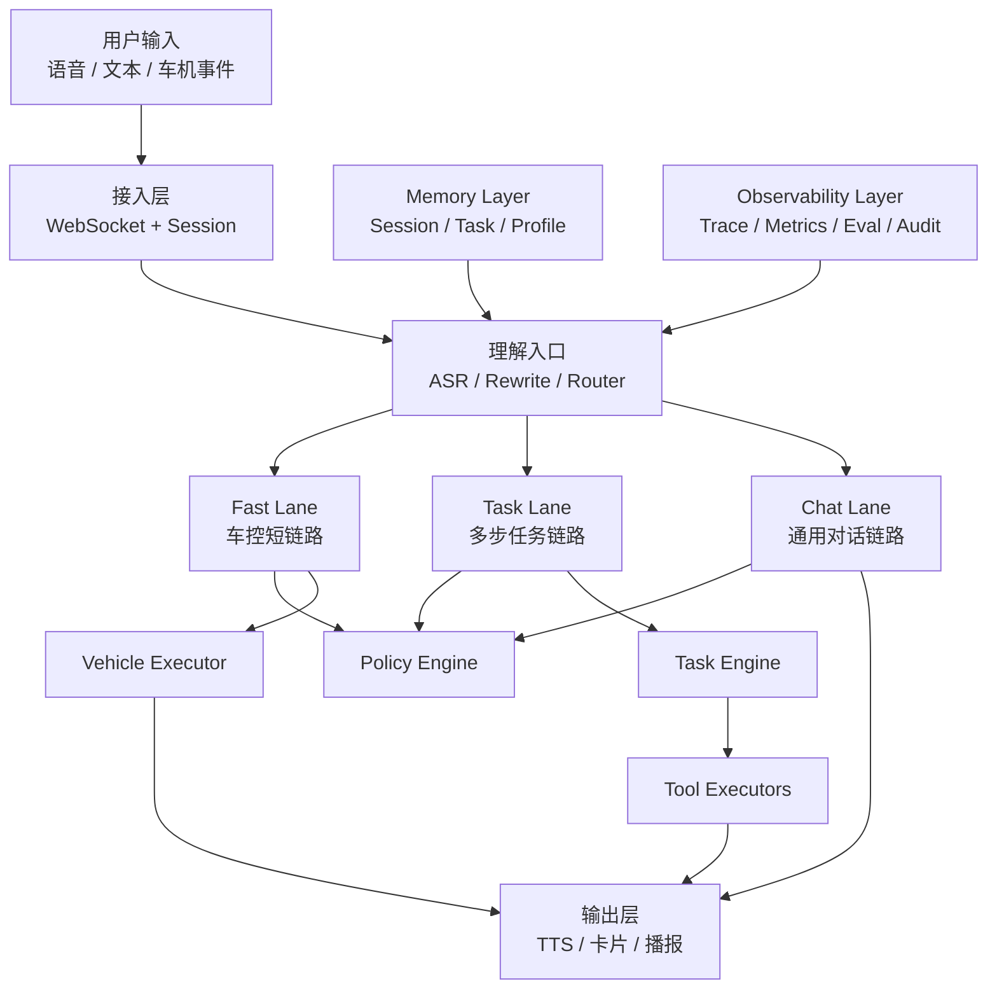

# 座舱助手迭代计划简版

## 1. 现在有什么问题

| 问题 | 现状表现 | 业务影响 |
|---|---|---|
| 主流程太重 | `websocket_handler` 承担了接入、路由、NLU、LLM-NLU、车控、MCP、TTS、落库等大量职责 | 新功能越来越难加，线上问题难排查，稳定性会越来越差 |
| 缺统一任务状态机 | 现在有 request_id、trace_id、缓存、历史，但没有统一的任务状态、重试、补偿、恢复机制 | 导航、支付、咖啡、搜索这类复杂任务容易断、乱、重试重复执行 |
| 高风险能力边界不够硬 | 车控有 guard，支付也接上了，但安全规则没有统一收口成策略中心 | 驾驶中支付、不可逆操作、误触发这类风险不好控 |
| 记忆体系分散 | history、persistent memory、agent context、user profile 都有，但职责不够统一 | 多轮对话容易串台，任务上下文和用户偏好容易互相污染 |
| 工具生态不统一 | 搜索、支付、导航、星巴克、加油、停车都接了，但输入输出契约不一致 | 新工具接入成本高，任务编排不稳定，失败恢复困难 |
| 语音链路还没完全收稳 | ASR、VAD、TTS、打断都已经做了，但降级和状态隔离还不够统一 | 用户会感知到“有时很顺，有时很乱”，体验不稳定 |
| 可观测性偏调试，不偏运营 | 有 trace、日志、测试接口，但缺少业务成功率、任务闭环率、时延质量看板 | 很难做灰度、复盘和持续优化 |

---

## 2. 要做什么事

这次迭代不建议继续堆功能，而是先把系统收口成一个更适合上线和长期演进的版本。

核心要做 5 件事：

| 要做的事 | 目的 |
|---|---|
| 重构主流程编排 | 把“一个大 handler”改成更清晰的执行链 |
| 建任务执行内核 | 让复杂任务可追踪、可恢复、可补偿 |
| 建统一安全策略层 | 让高风险动作都先过规则，再执行 |
| 建三层记忆体系 | 让多轮对话稳定，不串台 |
| 建统一工具契约和质量体系 | 让工具稳定接入，让系统可灰度、可优化 |

---

## 3. 要怎么做

## 3.1 主流程收口

把现在的大一统流程拆成三条链路：

- `Fast Lane`：车控短链路，优先快和稳
- `Task Lane`：导航、支付、咖啡、搜索等多步任务
- `Chat Lane`：通用问答、闲聊、深度思考

这样做的原因：

- 车控不能和复杂工具共用一套慢链路
- 任务型能力需要状态机，不该按聊天逻辑硬跑
- 通用对话可以更灵活，但不该污染任务执行

## 3.2 建任务执行内核

新增统一 `Task Engine`，把一次请求拆成：

- `Task`
- `Step`
- `Status`
- `Retry`
- `Compensation`

统一状态建议：

- `CREATED`
- `RUNNING`
- `WAIT_CONFIRM`
- `SUCCESS`
- `FAILED`
- `STALE`
- `CANCELLED`

这样做的原因：

- 现在复杂任务能跑，但不够可控
- 后续支付、下单、生活服务一定会越来越依赖任务闭环

## 3.3 建统一安全策略层

新增 `Policy Engine`，所有高风险动作执行前统一检查：

- 驾驶状态
- 车速
- 风险等级
- 是否可逆
- 是否需要二次确认
- 当前置信度

优先收口的对象：

- 支付
- 退款
- 车窗/天窗/门锁等高风险车控
- 不可逆操作

这样做的原因：

- 不能把安全边界分散在各个 service 里
- 要把“能不能执行”从业务代码里抽出来

## 3.4 建三层记忆体系

把现有记忆收口成三层：

| 记忆层 | 存什么 | 用在哪里 |
|---|---|---|
| Session Memory | 当前会话上下文 | 多轮理解、代词消解、短期连续对话 |
| Task Memory | 当前任务状态、候选项、确认信息 | 导航、搜索、支付、下单等任务 |
| Profile Memory | 用户车型、偏好、授权信息 | 个性化、账号能力、长期体验 |

这样做的原因：

- 现在不是没有记忆，而是记忆太散
- 需要防止聊天上下文污染任务状态

## 3.5 统一工具契约

所有工具统一成标准返回结构：

- `status`
- `display_text`
- `structured_data`
- `is_retryable`
- `next_action`
- `idempotency_key`

这样做的原因：

- Planner 和执行层才能稳定配合
- 新工具接入不会越来越乱

## 3.6 建质量与灰度体系

建立 4 类核心指标：

- 识别成功率
- 任务闭环率
- 语音时延体验
- 高风险动作拦截率

同时建立黄金场景评测集：

- 纯车控
- 混合意图
- 多轮导航
- 支付
- 搜索/深度思考
- 打断恢复

这样做的原因：

- 系统后续必须可灰度、可复盘、可持续优化

---

## 4. 做完会变成什么样子

## 4.1 业务上

| 做完后的样子 | 业务价值 |
|---|---|
| 车控变成一条短链路 | 驾驶中更快、更稳、更敢上线 |
| 复杂任务有状态机 | 支付、导航、生活服务更容易闭环 |
| 高风险动作统一过策略层 | 风险更低，审计更清楚 |
| 多轮对话有分层记忆 | 对话更连续，不容易串台 |
| 工具有统一契约 | 新能力接入更快，故障恢复更容易 |
| 质量可监控、可灰度 | 能持续优化，不靠人工盯日志 |

## 4.2 技术上

最终系统会更接近下面这个结构：

---

## 5. 一句话总结

这次最合适的迭代方向，不是继续把功能做得更多，而是把现有能力收口成一个：

**车控更稳、任务可闭环、安全有边界、对话不串台、上线可灰度的座舱助手系统。**
